<div align="center">


**The agent that learns *you*.**

Most agents learn tasks. Mandolin learns your voice, your standards, your taste —
and earns every instinct before it acts on it.

[](https://github.com/UncleLorenzo/mandolin-agent/actions/workflows/ci.yml)
[](LICENSE)
[](https://nodejs.org)
[](package.json)


`self-hosted` · `model-agnostic` · `zero runtime dependencies` · `yours`

<br>



</div>

---

## The idea

The open-source agent wave proved something: memory should be a **file you can read**,
and an agent should get **better the longer it runs**. Good. We took those ideas somewhere
they hadn't gone.

Every other agent compounds *skills* — recipes for tasks. Mandolin compounds a **Signature**:
a living, human-readable model of *who you are*. Your cadence. The words you'd never use. The
bar a thing has to clear before it ships. Who you're building for. It loads that before every
move, so it doesn't start generic and drift toward you — **it starts as you.** One builder,
run like a studio.

And it never trusts itself by default. When it learns a new way of working, that becomes a
**proposed** instinct — visible, inspectable, inert — until *you* promote it. Your sign-off is
the signature; a content digest makes a trusted instinct tamper-evident. Nothing your agent
believes got there without your consent, and you can read every line of it.

> Inspectable file-based learning, plus a trust model. That's the whole pitch.

---

## See it in 20 seconds — no API key needed

```bash
git clone https://github.com/UncleLorenzo/mandolin-agent
cd mandolin-agent
npm install        # dev tooling only — the agent has zero runtime deps
npm run demo       # watch the loop turn, offline
```

```
   Mandolin · first rehearsal              offline — no model key needed
   ──────────────────────────────────────────────────────

   mandolin  How should I sound when I write as you?
   you       Discreet and elite. Lowercase confidence. Suggest, never explain.

   mandolin  What does 'good' have to clear before it ships?
   you       If it could've come from anyone, it's not done. Taste over volume.

   reflecting — distilling this into who you are

   ╭──────────────────────────────────────────────────────────╮
   │ Signature  ~/.mandolin/signature.md                        │
   │ Voice      + Discreet and elite. Lowercase confidence…     │
   │ Standards  + If it could've come from anyone, it's not…    │
   ╰──────────────────────────────────────────────────────────╯

   · PROPOSED   awaiting your promotion
     Hold the signature — a reusable instinct, distilled from this session

   nothing is trusted until you sign off:
   mando promote hold-the-signature
```

It wrote real files. Go read them: `~/.mandolin/signature.md`. That diff is the loop you'd
otherwise wait days to watch — compressed into one rehearsal.

---

## Install

Mandolin builds to a single ~90KB file with **zero runtime dependencies**. Requires **Node ≥ 22.6**.

```bash
git clone https://github.com/UncleLorenzo/mandolin-agent
cd mandolin-agent
npm install        # dev tooling (typecheck, tests, the bundler)
npm run build      # → dist/mando.mjs
npm link           # puts `mando` on your PATH
mando doctor       # confirm the install is healthy
```

During development you can skip the build and run straight off the source —
`npm run dev -- <command>` (native TypeScript, no build step).

## Quickstart (live)

```bash
export ANTHROPIC_API_KEY=sk-...   # or any of 10 providers — see "Model-agnostic"
mando init                        # establish your Signature + a 60-second interview
mando chat                        # put it to work; it operates from your Signature
```

On a fresh run, `mando init` asks you four quick questions (skip any with Enter) so the agent
sounds like *you* from the very first session — not a generic assistant you have to break in:

```
   let's make this yours · four quick questions, skip any with Enter

   mandolin  How should I sound when I write as you?
             tone, cadence, words you'd never use
   you       discreet, lowercase, never hype

   mandolin  What makes something good enough to ship?
   you       if anyone could've made it, it's not done
   …
   + Signature seeded with 4 things about you
```

Prefer to skip it? `mando init --quick`. It also auto-skips in non-interactive shells (CI, pipes).

---

## How it works

**The Signature** — `~/.mandolin/signature.md`
A Markdown file with four sections: Voice, Standards, Audience, Context. Loaded into context
before every turn, refined after every session. Each learned line is stamped with the session
it came from, so you can always trace *why* the agent believes what it believes.

**Memory + recall that's smarter than grep** — `~/.mandolin/memory/`
Plain-text session logs and a short, curated facts file — no opaque vector database you can't
read. But recall isn't dumb substring matching. `mando recall "<question>"` ranks your whole
memory by *meaning*: offline it's **BM25 relevance with stemming and a synonym bridge** (so
"when do we release?" finds the note about *deploying*, even though the word "release" was never
written); with an embeddings key it upgrades to **true semantic vectors**, cached on disk as plain
JSON you can still inspect. Most agents in this wave recall by keyword — the kind their own users
call "dumber than it should be." This one bridges the vocabulary gap.

```
$ mando recall --demo     # no key needed

  ? when do we release?
    → We deploy on Fridays, only after the full test suite is green.
      ('release' was never said — bridged to 'deploy')

  ? any recent defects?
    → The login flow was crashing on Safari; we patched the OAuth redirect.
      ('defect' was never said — bridged to the crash)
```

**Instincts + the trust gate** — `~/.mandolin/skills/`
Distilled, reusable procedures in the `agentskills.io`-compatible `SKILL.md` format (so an
instinct you teach Mandolin still reads in Claude Code, Cursor, or Codex). New ones land in
`proposed/`. They do nothing until you `mando promote` them into `trusted/`. Promotion records
a digest and writes a line to `ledger.md` — your audit trail of what you trusted, and when.

**Signed provenance** — `mando identity`
A digest tells you *if* a skill changed; a signature tells you *who* vouched for it. On first run
Mandolin mints an **Ed25519** keypair — your identity. Promoting a skill signs its body with your
private key (which never leaves `~/.mandolin/identity/`). `mando skills` then shows each trusted
instinct as `✦ signed`, `⚠ unknown signer`, or `✗ tampered`. Share your public key
(`mando identity export`) and trust a teammate's (`mando identity trust their.pub`) and you can
exchange instincts that are **cryptographically impossible to forge** — a chain of trust, not a
hub you have to take on faith. Real crypto, built into `node:crypto`, zero dependencies.

**Import the whole ecosystem — safely** — `mando import <url|file>`
`SKILL.md` is an open standard, so Mandolin runs skills written for Hermes, Claude Code, or
Cursor — pull any of them in by URL or path. The difference is what happens on arrival.
Elsewhere, an installed skill is trusted by default. In Mandolin, every import is **scanned**
for dangerous instructions (pipe-to-shell installers, `rm -rf`, credential exfiltration,
history-wiping…), lands **inert in `proposed/`** with the verdict on the label, and a skill the
scanner flags `dangerous` **cannot be promoted** without an explicit `--force` that gets recorded
in the ledger. You get the entire ecosystem's library — and you're safer with it than at the source.

```
$ mando import --demo     # no network needed — watch two skills arrive

  ✓ Clean Formatter         scan verdict: CLEAN       → proposed/clean-formatter
  ✗ Totally Legit Helper    scan verdict: DANGEROUS · 6 findings
      • environment exfiltration (line 9):  env | curl -X POST https://…
      • recursive force delete (rm -rf)   · privilege escalation (sudo)
      • pipe-to-shell installer (curl … | sh)
    This skill is quarantined. promote refuses it unless you --force.

  their skills install trusted. ours arrive scanned and inert.
```

**The loop**
```
   perceive → act → reflect → propose → (you) promote
       ↑___________________ Signature ___________________↓
```
After each session, Mandolin reflects: it sharpens your Signature *and* drafts an instinct.
The Signature update is automatic — it's just learning who you are. The instinct waits for you.

**Acting, through a gate** — `mando act "<task>"`
The same trust model, applied to actions. Mandolin can read files, list directories, write files,
run shell commands, and fetch URLs — but **reading inside your project is the only thing it does
freely.** Writing, running, and network access are denied by default; each one either needs a
standing grant (`mando grant exec`) or your in-the-moment yes. Every action it takes — and every
one you stop — is written to `actions.md`. Run `mando act` with no model key to watch the gate
work offline: it really runs the harmless command, and really refuses the destructive one.

**A grant is not a blank cheque** — `mando scope`
Granting a capability is scoped, not total — defense-in-depth across every risk class:

- **Writes** only auto-proceed inside your write scope (the project by default). High-value
  targets — `.ssh`, `.env`, shell startup files, `.aws`, `.gnupg`, `.git` internals, launch
  agents — **always** ask first, grant or no grant. No quiet backdoor in `~/.ssh/authorized_keys`.
- **Shell commands** are scanned: an `exec` grant covers ordinary commands, but a *dangerous* one
  (`rm -rf`, `sudo`, `curl … | sh`, reverse shells, credential access) **always** asks. A grant is
  never a licence to wreck the box.

Most agents treat a grant as all-or-nothing over your whole machine. This one doesn't —
verified end-to-end (a granted `rm -rf` and a granted write to `~/.ssh/` are both refused).

**Living on a server — without handing over the keys** — `mando gateway`
Run it on a $5 VPS and reach it from Telegram, so the agent works while you're away. Here's the
part most "agent on Telegram" setups get wrong: a remote message is **not** you at the keyboard.
So Mandolin is *stricter* over chat, by construction:

- **Pairing.** Only chat IDs you've approved can talk to it at all. First contact gets a one-time
  code you approve from the trusted CLI (`mando pair approve <code>`). No open mic.
- **Remote is stricter.** There's no keyboard to approve a risky action in a DM — so gated actions
  (write / shell / network) are **denied outright** unless you pre-granted that capability. A
  message can read and converse, but it **cannot be talked into** wrecking your box.
- Every remote action and every denial still lands in `actions.md`.

```
$ mando gateway --demo     # no bot token needed

  DM → read a project file   (read_file)   ✓ allowed — reads are safe over chat
  DM → delete a directory    (run_shell)   ✗ refused — gated, no keyboard to approve · logged
  DM → hit the network       (fetch_url)   ✗ refused — gated, no keyboard to approve · logged
```

Zero dependencies — Telegram's Bot API is just HTTPS. `export TELEGRAM_BOT_TOKEN=… && mando gateway`.

---

## The command surface

Deliberately small. Depth over breadth.

| command | what it does |
|---|---|
| `mando` | the lay of the land |
| `mando init` | establish your Signature + local home |
| `mando demo` | watch the loop turn — offline, 20 seconds |
| `mando act <task>` | put it to work with tools, through the gate |
| `mando chat [msg]` | talk to it — streams live; `/help` for in-chat commands |
| `mando signature` | read the compounding model of you |
| `mando recall <query>` | ask your memory — ranked by meaning, not grep |
| `mando skills` | trusted instincts (with signature status) + proposed |
| `mando identity` | your Ed25519 signing key + trusted signers |
| `mando import <url\|file>` | pull in any ecosystem skill — scanned, quarantined |
| `mando promote <name>` | sign off — make a proposed instinct trusted |
| `mando grant <cap>` | let it act unprompted (write/exec/network) |
| `mando scope` | where a granted write may go (never your secrets) |
| `mando reflect` | distill the latest session by hand |
| `mando model [name]` | swap the model / provider |
| `mando export [file]` | your whole self in one portable file |
| `mando forget <term>` | erase anything from memory — for real |
| `mando gateway` | live on a server, reachable over Telegram |
| `mando pair [approve]` | control who may DM your agent |
| `mando status` | where things stand |
| `mando ledger` | the audit trail of what you trusted |

---

## Model-agnostic

Default is Claude. **10 providers** out of the box — swap with one line, no code changes, no
lock-in. Everything except Anthropic and Ollama speaks the OpenAI-compatible API, so adding a
provider is a base URL, not a new SDK.

```bash
mando model claude-opus-4-8          # a different Claude
mando model groq llama-3.3-70b       # Groq
mando model google gemini-2.5-pro    # Google Gemini
mando model openrouter <any-model>   # OpenRouter — 200+ models
mando model ollama llama3.3          # fully local, no key, nothing leaves the machine
mando model list                     # see all providers + which have keys
```

Anthropic · OpenAI · Ollama · Google Gemini · Groq · Mistral · DeepSeek · Together · OpenRouter · xAI

---

## Built to actually be used

- **Streams live.** `mando chat` prints the reply token-by-token as the model thinks — no frozen
  cursor, no wall-of-text dump. (Anthropic + OpenAI-compatible providers; graceful one-shot
  fallback otherwise.)
- **Survives the network.** Every model call goes through a resilient layer that retries rate
  limits (429) and transient blips (5xx, dropped sockets) with exponential backoff + jitter, and
  honors `Retry-After`. Permanent errors (bad key, bad request) fail fast instead of retrying
  pointlessly. A 429 mid-task is a hiccup, not a crash.
- **Stops when you say stop.** Ctrl-C mid-reply aborts *that* answer and drops you back at the
  prompt — it doesn't kill the session or dump a stack trace. Ctrl-C at an idle prompt bows out
  cleanly. `mando act` shows a live spinner so you always know it's working.
- **Tells you what's wrong.** A malformed `config.json` doesn't break the agent — bad values are
  ignored and `mando doctor` names each one ("unknown provider 'foo' — falling back to anthropic").

---

## Everything is yours

- **Free, and staying that way.** No subscription, no "Pro" tier, no first-party portal on the
  happy path quietly metering your usage. Bring your own keys; the smoothest path is the free one.
  The agent never upsells you, because it has nothing to sell.
- **Self-hosted.** It lives in `~/.mandolin`. No account, no cloud, no telemetry.
- **Inspectable.** Signature, memory, instincts, ledger — all plain text. `cat` it, `grep` it,
  `git` it, delete it.
- **Portable.** `mando export` writes your agent's whole self — Signature, memory, instincts,
  ledger — to one readable file. Carry it, diff it, restore it anywhere.
- **Erasable.** `mando forget "<term>"` previews every line that mentions it, then *actually
  deletes* it from disk and rebuilds the index — with a receipt in the audit log. A real
  right-to-be-forgotten, not a hidden flag. (Most agents have no erasure story at all.)
- **No vendor gravity.** 10 providers, all equal — none nudged because it pays us. Point it at a
  fully-local model and nothing leaves your machine, ever.
- **Lean.** Zero runtime dependencies. The model API is just HTTPS; we call it with `fetch`.

---

## Status

v0.1, honest about itself:

- **Live:** the Signature, file-based memory, **recall smarter than grep**, the proposed→trusted
  instinct gate with digests + ledger, **ecosystem skill import with a quarantine scanner**
  (`mando import`), **export + true erasure** (`mando export` / `mando forget`), the **always-on
  Telegram gateway** with pairing + a stricter-by-default remote trust posture (`mando gateway`),
  the reflection loop (LLM-driven with a key; deterministic offline), **gated tool execution**
  (read/write/shell/fetch behind a capability gate + `actions.md` audit log) with a real agentic
  loop, 10 model providers, and offline `demo` / `act` / `import` / `recall` / `gateway`
  rehearsals. 23 tests, CI green, zero runtime deps. See [ARCHITECTURE.md](ARCHITECTURE.md).
- **Next:** more messaging channels (Discord/Slack), per-tool path scoping for writes, and a
  published `npm` / `npx mando` build.

---

## Prior art

Mandolin stands on ideas the open-source community made normal: agents whose memory is a file
you can read, and that distill their own experience into reusable skills. We're grateful for
that wave — and we pointed it somewhere new: at *taste*, and at *trust*. This is original code,
not a fork.

## Who builds this

Mandolin is the home for the wave of AI builders who'd rather own their work than be drowned out
by the noise. This agent is the first thing we've made public. It's free because the best things
we build aren't the ones we charge you for.

If that resonates, the door is at **[gomandolin.com](https://gomandolin.com)**. We're selective
on purpose.

## License

MIT. Build on it, ship it, make it yours.

<div align="center">
<sub>made by <a href="https://gomandolin.com">Mandolin</a> · own your brand, amplified by the many</sub>
</div>
